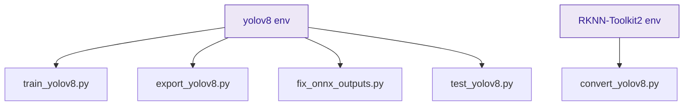
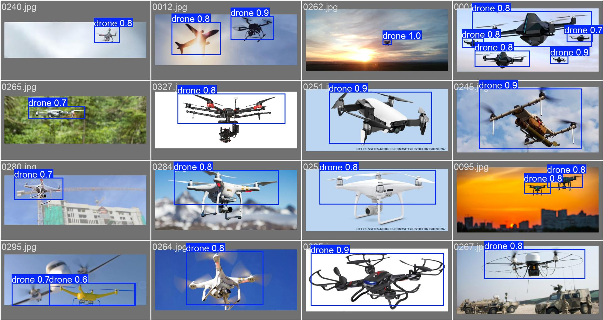
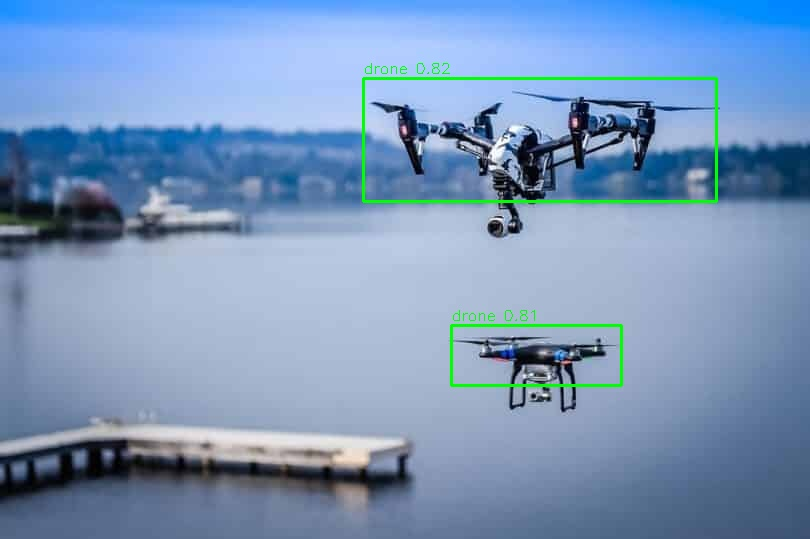
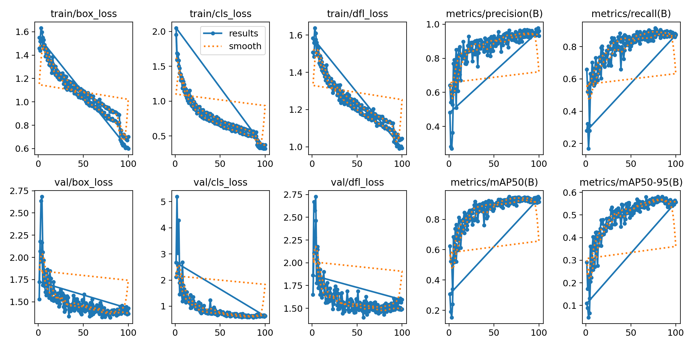
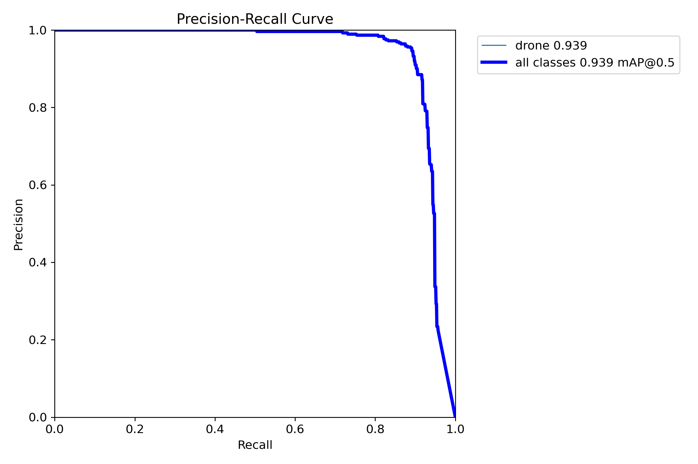
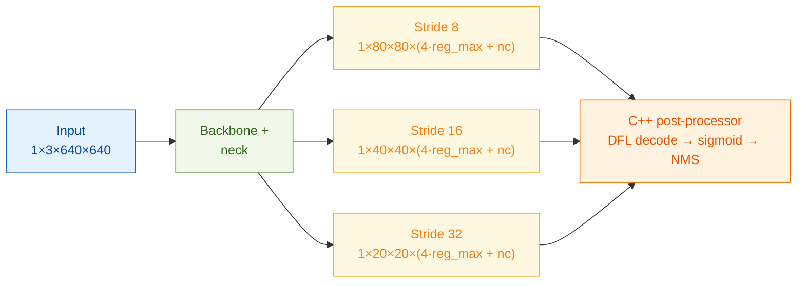

# RKNN_TRAIN_YOLO — Train & Deploy YOLO Models on Rockchip NPUs

An end-to-end toolchain to **train, export, quantise, and deploy YOLOv8 / YOLOv5 object detectors** on Rockchip NPUs (RK3588/RK3588S and related platforms) via RKNN.

The pipeline is **dataset-agnostic** — point it at any YOLO-format dataset with any number of classes. It takes you from a raw dataset all the way to an INT8-quantised `.rknn` model ready for on-board inference, with the ONNX graph rewritten to match the layout expected by a C++ NPU post-processor.

> **Reference use case:** this repository was originally built and validated for a **single-class UAV/drone detector** running on a Khadas Edge2 (RK3588S) with an OS08A10 camera (1920×1080) in an indoor, low-light environment. That worked example is referenced throughout as a concrete illustration, but nothing in the pipeline is drone-specific.

---

## Pipeline at a glance

```mermaid
flowchart LR
    DS["YOLO dataset<br/>images + labels + data.yaml"]:::data
    PT[".pt weights<br/>trained model"]:::artifact
    ONNX["ONNX<br/>RKNN export format"]:::artifact
    FIX["_fixed.onnx<br/>graph rewritten for<br/>C++ post-processor"]:::artifact
    RKNN[".rknn<br/>INT8 quantised"]:::artifact
    CPP["On-board C++<br/>NPU inference"]:::deploy

    DS -->|"1 · train"| PT
    PT -->|"2 · export"| ONNX
    ONNX -->|"2b · fix graph"| FIX
    FIX -->|"3 · convert + quantise"| RKNN
    RKNN -->|"4 · validate / deploy"| CPP

    classDef data fill:#e3f2fd,stroke:#1565c0,color:#0d47a1;
    classDef artifact fill:#f1f8e9,stroke:#558b2f,color:#33691e;
    classDef deploy fill:#fff3e0,stroke:#ef6c00,color:#e65100;
```



Each stage maps to one script in `yolov8_pipeline/` (and the mirror set in `yolov5_pipeline/`). Run them individually, or chain stages 1–3 with `_full_pipeline.py`.



---

## Results

The reference single-class `drone` model, trained and validated with this pipeline.

| Validation predictions (FP32) | INT8 RKNN-simulator output |
|---|---|
|  |  |

| Training curves | Precision–Recall (mAP@0.5 = 0.939) |
|---|---|
|  |  |

> Left column shows the trained PyTorch model; the right detection image is produced by the **INT8 RKNN model running in the RKNN simulator**, confirming quantisation preserves accuracy before on-board deployment. Swap these for your own dataset's outputs.

> **Image credit:** the sample frames above are from the MIT-licensed **Drone Dataset (UAV)** by Mehdi Özel, with this project's detection boxes overlaid. See [res/imgs/DATASET_LICENSE](res/imgs/DATASET_LICENSE) for the copyright and license notice.

---

## Features

- **Two model families:** Rockchip forks of Ultralytics YOLOv8 and YOLOv5, with NPU-friendly export.
- **Full pipeline scripts:** train → export ONNX → fix ONNX graph → convert to INT8 RKNN → validate.
- **One-command pipeline:** run all stages in sequence with `_full_pipeline.py`.
- **NPU optimisations:** optional SiLU → ReLU activation swap; INT8 quantisation tuned for Rockchip Toolkit2 v2+.
- **Any dataset / any classes:** standard YOLO label format; just edit `data.yaml`.
- **Auto-managed conda environments:** scripts re-exec themselves under the correct environment.

---

## Repository structure

```
<your_dataset>/         Training dataset (YOLO format, N classes)
  images/train|valid/
  labels/train|valid/
  data.yaml

yolov8/                 Rockchip fork of Ultralytics YOLOv8 (submodule)
yolov5/                 Rockchip fork of YOLOv5 (submodule)

yolov8_pipeline/        Scripts and config for the YOLOv8 model
  train_yolov8.py       1  — Train
  export_yolov8.py      2  — Export .pt → ONNX (RKNN format)
  fix_onnx_outputs.py   2b — Rewrite ONNX graph for C++ post-processor
  convert_yolov8.py     3  — Convert ONNX → .rknn (INT8 quantised)
  test_yolov8.py        4  — Validate / run inference
  _full_pipeline.py     Run steps 1–3 in one command
  setup_files/          Calibration image list and supporting config
  yolov8_instructions.md    Step-by-step pipeline guide

yolov5_pipeline/        Scripts and config for the YOLOv5 model
  train_yolov5.py
  export_yolov5.py
  convert_yolov5.py
  test_yolov5.py
  calibration_images.txt
  RK_anchors.txt            Anchor values generated at export time

rknn_files/
  yolov8/               Generated artifacts: .onnx, _fixed.onnx, .rknn
  yolov5/               Generated artifacts: .onnx, .rknn

runs/train/             Training outputs (weights, metrics)
```

---

## Dataset

Use any dataset in **standard YOLO format** (one `.txt` label file per image, normalised `class x y w h`). Define your classes and image paths in `data.yaml`, then point the training script at it.

**Negative samples** (images with empty label files) are strongly recommended to reduce false positives. Choose backgrounds that match your deployment domain.

> **In the reference drone build**, the single `drone` class was trained with two kinds of negatives — road/urban backgrounds (to suppress false positives on structured outdoor scenes) and dark/blueish basement frames (to bridge the domain gap to the indoor deployment environment). HSV value augmentation (`hsv_v=0.6`) was enabled to improve robustness to low light. Adapt these choices to your own domain.

---

## Conda environments

| Environment | Purpose |
|---|---|
| `yolov8` | Training, export, and validation |
| `RKNN-Toolkit2-rk3588s` | ONNX → RKNN conversion (INT8 quantisation) |

The training/export scripts auto-re-exec under `yolov8`; the conversion script requires the RKNN Toolkit2 environment. RKNN-Toolkit2 version used: **2.3.2**.

### Interpreter resolution

The scripts locate each environment's Python interpreter automatically — no paths are hardcoded. Resolution order:

1. An explicit override environment variable, if set: `YOLOV8_PYTHON`, `YOLOV5_PYTHON`, or `RKNN_PYTHON`.
2. The active conda installation (via `CONDA_EXE` / `CONDA_PREFIX`).
3. Common install locations (`~/miniconda3`, `~/anaconda3`, `~/miniforge3`, `~/mambaforge`).

If your environments live elsewhere (or you don't use conda), point the override variables at the right interpreters, e.g.:

```bash
export YOLOV8_PYTHON=/opt/conda/envs/yolov8/bin/python
export RKNN_PYTHON=/opt/conda/envs/RKNN-Toolkit2-rk3588s/bin/python
```

---

## YOLOv8 pipeline (quick reference)

All commands run from the workspace root. Replace the dataset and model paths with your own as needed.

```bash
# 1 — Train
conda activate yolov8
python yolov8_pipeline/train_yolov8.py

# 2 — Export to RKNN-format ONNX
conda activate yolov8
python yolov8_pipeline/export_yolov8.py

# 2b — Fix ONNX graph for C++ post-processor
conda activate yolov8
python yolov8_pipeline/fix_onnx_outputs.py \
    rknn_files/yolov8/best_yolov8n.onnx \
    rknn_files/yolov8/best_yolov8n_fixed.onnx

# 3 — Convert to RKNN (INT8)
conda activate RKNN-Toolkit2-rk3588s
python yolov8_pipeline/convert_yolov8.py \
    rknn_files/yolov8/best_yolov8n_fixed.onnx \
    yolov8_pipeline/setup_files/calibration_images.txt \
    rknn_files/yolov8/best_yolov8n.rknn \
    --platform rk3588s

# 4 — Validate
conda activate yolov8
python yolov8_pipeline/test_yolov8.py --mode val
```

Run the whole thing in one command:

```bash
python yolov8_pipeline/_full_pipeline.py
```

See [yolov8_pipeline/yolov8_instructions.md](yolov8_pipeline/yolov8_instructions.md) for full options, and [yolov5_pipeline/yolov5_instructions.md](yolov5_pipeline/yolov5_instructions.md) for the YOLOv5 pipeline.

---

## Supported target platforms

The conversion step accepts any of the following RKNN platforms via `--platform`:

`rk3566`, `rk3568`, `rk3588`, `rk3588s`, `rv1103`, `rv1106`, `rk2118`

---

## Board deployment notes

- **BGR → RGB:** correct channel order in your C++ preprocessing (e.g. via RGA hardware) — `reorder_channel` is not used in the convert step (not supported by Toolkit2 v2+).
- **Quantisation:** INT8, `mean=[0,0,0]`, `std=[255,255,255]`, `optimization_level=3`.
- **Post-processor:** reads 3 NHWC tensors `[1, h, w, 4·reg_max + num_classes]` (one per stride: 80×80, 40×40, 20×20 for a 640px input). Class logits are pre-sigmoid; apply sigmoid once in C++ after dequantisation.

> The reference drone model is single-class, so its tensors are `[1, h, w, 65]` (64 box-distribution channels + 1 class). The channel count scales with your number of classes.

Output-head layout consumed by the C++ post-processor (640px input shown):




---

## Acknowledgements

The reference drone build was trained on an **augmented version** of the **Drone Dataset (UAV)** by **Mehdi Özel**, released under the [MIT License](https://spdx.org/licenses/MIT.html). The original data was extended with additional **negative samples** (road/urban backgrounds and dark/blueish basement frames) and **HSV-value augmentation** for low-light robustness.

The dataset itself is **not redistributed** in this repository — download it from the source below. The only dataset frames included here are the two sample images under [res/imgs](res/imgs) (used for the Results section), which carry the dataset's MIT copyright and license notice in [res/imgs/DATASET_LICENSE](res/imgs/DATASET_LICENSE).

- Source: [Kaggle — Drone Dataset (UAV)](https://www.kaggle.com/datasets/dasmehdixtr/drone-dataset-uav?select=drone_dataset_yolo)
- Dataset Ninja mirror: [datasetninja.com/drone-dataset-uav](https://datasetninja.com/drone-dataset-uav)

```bibtex
@dataset{drone_dataset_uav_2019,
  author = {Mehdi Özel},
  title  = {Drone Dataset (UAV)},
  year   = {2019},
  url    = {https://www.kaggle.com/datasets/dasmehdixtr/drone-dataset-uav?select=drone_dataset_yolo}
}
```

---

## License


Copyright (C) 2026 alebal123bal

This project is licensed under the **GNU Affero General Public License v3.0 (AGPL-3.0)** — see [LICENSE](LICENSE) for the full text.

It bundles Rockchip's forks of Ultralytics YOLOv8 and YOLOv5, which are themselves distributed under AGPL-3.0 (see [yolov8/LICENSE](yolov8/LICENSE) and [yolov5/LICENSE](yolov5/LICENSE)). Because the combined work incorporates AGPL-3.0 code, the project as a whole is released under the same license.
